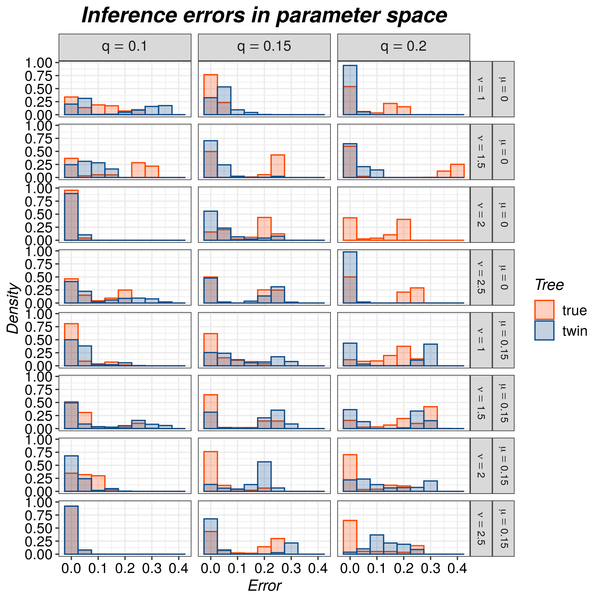
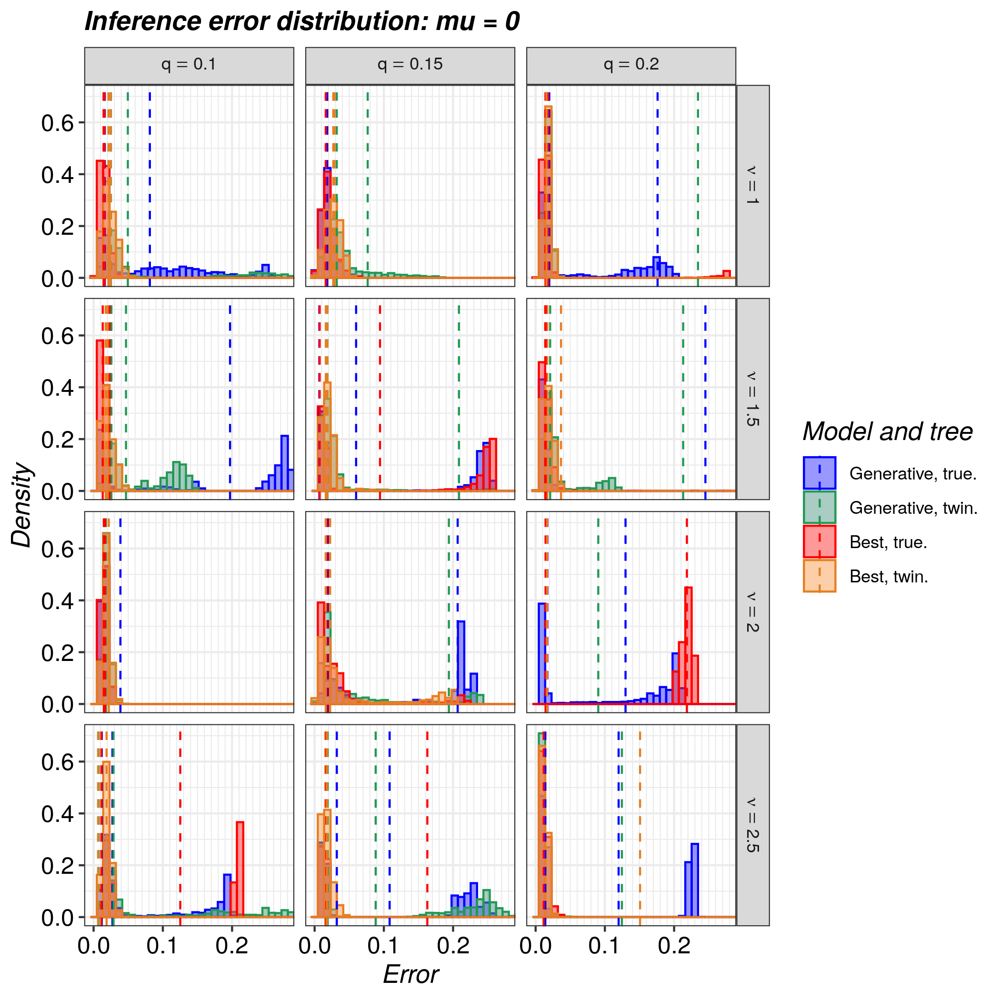
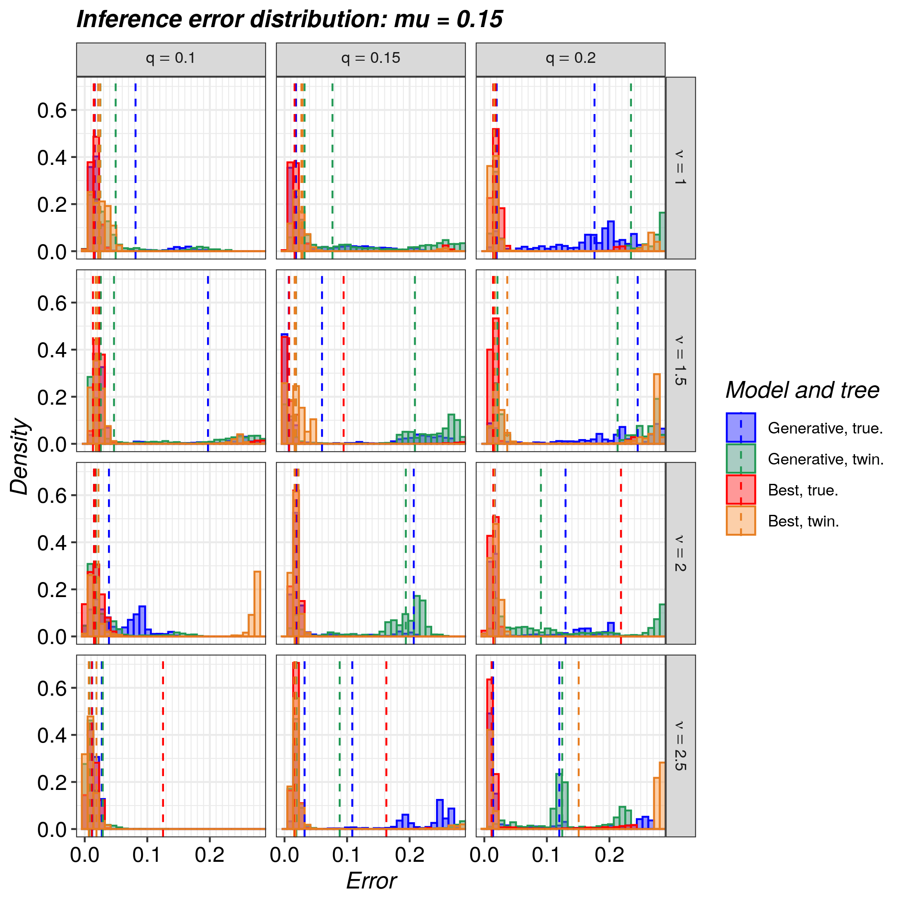

# razzo_project

Branch|
---|---
`master`|
`develop`|

`razzo` experiment scripts and storage.

## Data

Date                                                                                                          |n replicates|Crown age|MCMC chain length|Number of candidate models
--------------------------------------------------------------------------------------------------------------|------------|---------|-----------------|--------------------------
[20190808](http://richelbilderbeek.nl/razzo_project_20190808.zip)                                             |2           |6        |111k             |2 [*]
[20190815](http://richelbilderbeek.nl/razzo_project_20190815.zip)                                             |2           |7        |111k             |2
[20190829](http://richelbilderbeek.nl/razzo_project_20190829.zip)                                             |2           |6        |?100k            |39
[20190903](http://richelbilderbeek.nl/razzo_project_20190903.zip)                                             |2           |?5       |?100k            |39
[20190904](http://richelbilderbeek.nl/razzo_project_20190904.zip)                                             |2           |6        |?100k            |3
[20190905](http://richelbilderbeek.nl/razzo_project_20190905_unfinished_preliminary_results.zip) (unfinished) |10          |6        |?100k            |3

Number of candidate models|Setup ([see Issue](https://github.com/richelbilderbeek/razzo/issues/261))
--------------------------|------------------------
2                         |1: Old skool
39                        |2: All candidate models
3                         |3: Richel's setup

## Results

### 20190828

#### Oldskool

Only shows candidate

#### Newschool

## Folder structure

`razzo_project` has the following folder structure:

 * `scripts`: contains the scripts

The scripts in `scripts` create the following extra folders:

 * `data`: contains the simulation data
 * `results`: contains the simulation results

## Cluster usage

:warning: must run from the root folder

Regenerate testing data:

 * `sbatch ./scripts/regen_data.sh`

Run the razzo experiment:

 * `sbatch ./scripts/1_install_razzo.sh`
 * `sbatch ./scripts/2_create_parameter_files.sh test` or `sbatch ./scripts/2_create_parameter_files.sh ful`
 * `sbatch ./scripts/3_run_razzo.sh`
 * `sbatch ./scripts/7_create_nltt_stats_file.sh`
 * `sbatch ./scripts/8_create_esses_files.sh`
 * `sbatch ./scripts/9_create_marg_liks_file.sh`
 * `sbatch ./scripts/10_create_fig_1_file.sh`
 * `sbatch ./scripts/11_create_n_taxa_file.sh`

## Local usage

Same, but without `sbatch`.

See [.travis.yml](.travis.yml) for the complete usage.

## `mcbette` timeseries

n_taxa|n_nucleotides|run_time
---|---|---
10|1k|0:40 or 40 mins
20|1k|1:23 or 83
40|1k|3:35 or 215 mins
80|1k|more than 10 hours, got cancelled
