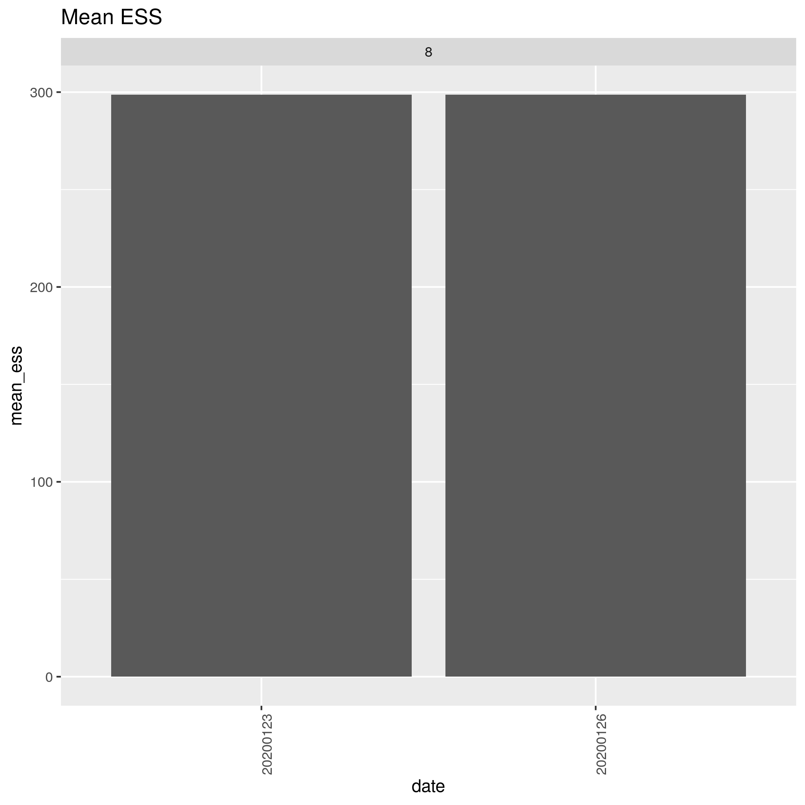
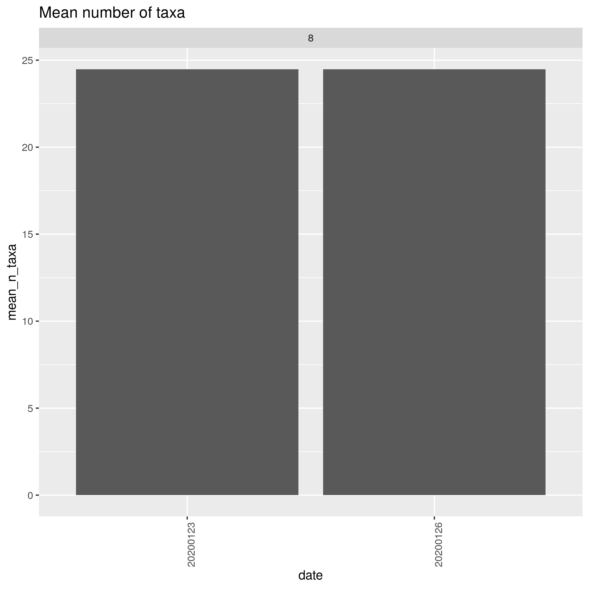
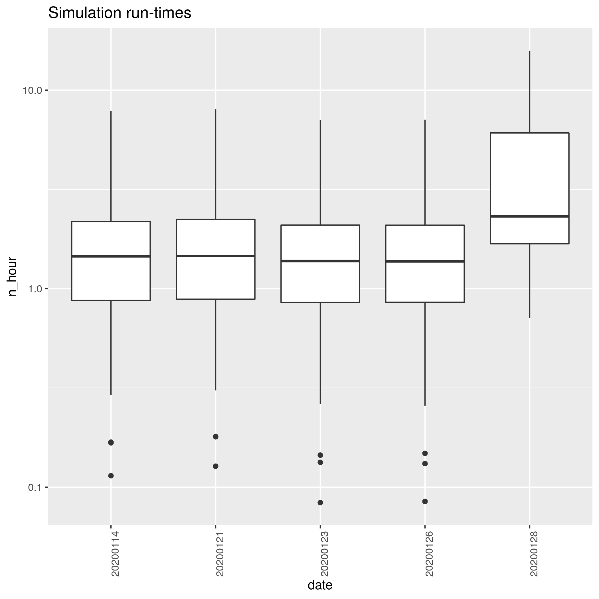
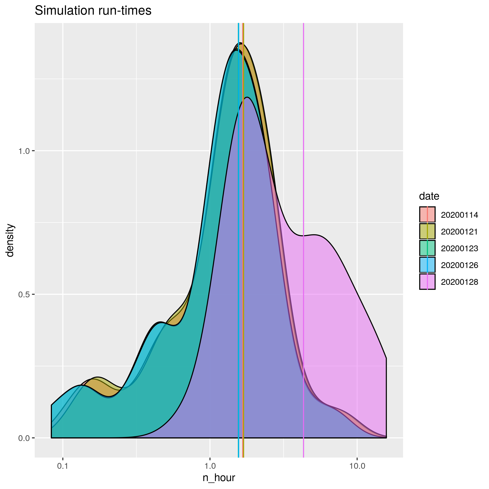

# razzo_project

Branch|[](https://travis-ci.org)
---|---
`master`|[](https://travis-ci.org/richelbilderbeek/razzo_project)
`develop`|[](https://travis-ci.org/richelbilderbeek/razzo_project)

`razzo` experiment scripts and storage.

## Data

To create the table below:

```
cd razzo_project
./scripts/90_collect_run_times.sh
```


|date     | mean_runtime_hours| crown_age| n_candidates| mcmc_chain_length| n_particles| n_replicates| mean_n_taxa| mean_ess| perc_low_ess| dna_length|
|:--------|------------------:|---------:|------------:|-----------------:|-----------:|------------:|-----------:|--------:|------------:|----------:|
|20190801 |          0.6439931|         6|            3|           1111000|           1|            2|    26.81250| 552.0521|     27.08333|       1000|
|20190808 |          0.6791088|         6|            3|           1111000|           1|            2|    26.81250| 541.2969|     31.25000|       1000|
|20190815 |          1.6287905|         7|            3|           1111000|           1|            2|    56.75000| 463.0667|     36.66667|       1000|
|20190829 |          3.3101975|         6|           40|           1000000|           1|            2|    26.81250| 421.7337|     39.13043|       1000|
|20190903 |          4.1418981|         6|           40|           1000000|           1|            2|    26.81250| 429.4056|     37.77778|       1000|
|20190904 |          0.6348322|         6|            4|           1000000|           1|            2|    26.81250| 478.9740|     31.25000|       1000|
|20190905 |          0.6264041|         6|            4|           1000000|           1|           10|    28.33333| 502.4483|     28.90295|       1000|
|20190906 |          0.3879977|         5|            4|           1000000|           1|            2|    17.66667| 610.8542|     19.27083|       1000|
|20190908 |          0.6437963|         6|            4|           1000000|           1|            2|    26.81250| 478.9740|     31.25000|       1000|
|20190910 |          0.1362500|         6|            4|           1000000|           1|            2|    26.81250| 583.5312|     16.66667|        100|
|20190911 |          1.0103827|         7|            4|           1000000|           1|            2|    56.75000| 400.4140|     41.93548|       1000|
|20190912 |         21.3550000|         6|            4|           1000000|          10|            2|    26.81250| 499.7165|     30.92784|       1000|

 * `20190908` is the favorite starting point
 * The `n_particles` in `20190908` and `20190910` is correct to the actual value of 1, due to a `mcbette` error 

To download the data, 
download `http://richelbilderbeek.nl/razzo_project_[date].zip` where `[date]` is the date, 
for example: [http://richelbilderbeek.nl/razzo_project_20190801.zip](http://richelbilderbeek.nl/razzo_project_20190801.zip)

## Results












### Figure 1b.

#### 20190801


#### 20190808


#### 20190815


#### 20190829


#### 20190903


#### 20190904


#### 20190905


#### 20190906


### Marginal likelihoods

#### 20190801


#### 20190808


#### 20190815


#### 20190829


#### 20190903


#### 20190904


#### 20190905


#### 20190906


#### 20190908


## Folder structure

`razzo_project` has the following folder structure:

 * `scripts`: contains the scripts

The scripts in `scripts` create the following extra folders:

 * `data`: contains the simulation data
 * `results`: contains the simulation results

## Cluster usage

:warning: must run from the root folder

Regenerate testing data:

 * `sbatch ./scripts/regen_data.sh`

Run the razzo experiment:

 * `sbatch ./scripts/1_install_razzo.sh`
 * `sbatch ./scripts/2_create_parameter_files.sh test` or `sbatch ./scripts/2_create_parameter_files.sh ful`
 * `sbatch ./scripts/3_run_razzo.sh`
 * `sbatch ./scripts/7_create_nltt_stats_file.sh`
 * `sbatch ./scripts/8_create_esses_files.sh`
 * `sbatch ./scripts/9_create_marg_liks_file.sh`
 * `sbatch ./scripts/10_create_fig_1_file.sh`
 * `sbatch ./scripts/11_create_n_taxa_file.sh`

## Local usage

Same, but without `sbatch`.

See [.travis.yml](.travis.yml) for the complete usage.

## `mcbette` timeseries

n_taxa|n_nucleotides|run_time
---|---|---
10|1k|0:40 or 40 mins
20|1k|1:23 or 83
40|1k|3:35 or 215 mins
80|1k|more than 10 hours, got cancelled
